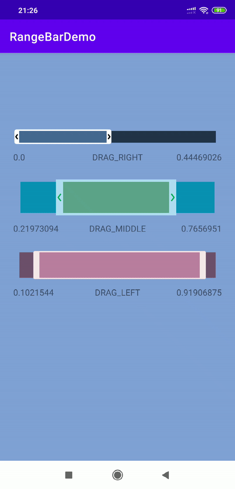

# RangeBar by bios90
Library for Android that allows you to select video timeline or any other data that requires range selection.



# Usage

*For quick overview of library features you can inspect [demo app xml](https://github.com/bios90/rangebar/blob/main/app/src/main/res/layout/activity_main.xml)*

1. Include the library as local library project.

	```
	allprojects {
	   repositories {
	      jcenter()
	      maven { url "https://jitpack.io" }
	   }
	}
	```

    ``` 
    implementation "com.github.bios90:rangebar:1.4" 
    ```

2. Add RangeBar to your xml layout

    ```xml
    <com.bios.rangebar.RangeBar
       android:id="@+id/rb"   
       android:layout_width="match_parent"
       android:layout_height="wrap_content"
       android:paddingLeft="24dp"
       android:paddingRight="24dp"
       app:color_arrow="#61707D"
       app:color_border="#F5FBEF"
       app:color_not_selected="#8055D6BE"
       app:color_selected="#807D5BA6"
       app:color_time_line="#ffffff"
       app:connectors_height="4dp"
       app:progress_left="0.25"
       app:progress_right="0.75"
       app:thumb_radius="4dp"
       app:thumb_width="12dp" />
    ```
    That image explains what each attribute is responsible for
    

3. Add RangeChangeListener in your code
    ```java
    RangeBar rb_1 = findViewById(R.id.rb_1);
    rb_1.setRangeChangeListener(new RangeBar.Listener()
    {
        @Override
        public void onDrag(float pos_left, float pos_right, RangeBar.State mode)
        {
            Log.i("RangeBar", "Position left is " + pos_left + " | Position right is " + pos_right);
            Log.i("RangeBar", "Drag mode is " + mode);
        }
    });
    ```
    In method ```onDrag``` you will get left and right thumb positions. This position will be floats if range ```0..1```. You can also get drag mode, which has three possible values 
    ```DRAG_LEFT|DRAG_RIGHT|DRAG_MIDDLE```

    You can also get current values of thumb by calling 
    ```java
    float pos_left = rb_1.getLeftPos();
    float pos_right = rb_1.getLeftPos();
    Log.i("RangeBar", "Position left is " + pos_left + " | Position right is " + pos_right);
    ```
4. You can also set progress left and progress right programmatically or in xml layout
    ```xml
    <com.bios.rangebar.RangeBar
       ...
       app:progress_left="0.25"
       app:progress_right="0.75"
       ... />
    ```

     ```java
    rb_1.setProgressRight(0.8f);
    rb_1.setProgressLeft(0.5f);
    ```

## MIT License

Copyright (c) 2021 Philipp Besyadovsky

Permission is hereby granted, free of charge, to any person obtaining a copy
of this software and associated documentation files (the "Software"), to deal
in the Software without restriction, including without limitation the rights
to use, copy, modify, merge, publish, distribute, sublicense, and/or sell
copies of the Software, and to permit persons to whom the Software is
furnished to do so, subject to the following conditions:

The above copyright notice and this permission notice shall be included in all
copies or substantial portions of the Software.

THE SOFTWARE IS PROVIDED "AS IS", WITHOUT WARRANTY OF ANY KIND, EXPRESS OR
IMPLIED, INCLUDING BUT NOT LIMITED TO THE WARRANTIES OF MERCHANTABILITY,
FITNESS FOR A PARTICULAR PURPOSE AND NONINFRINGEMENT. IN NO EVENT SHALL THE
AUTHORS OR COPYRIGHT HOLDERS BE LIABLE FOR ANY CLAIM, DAMAGES OR OTHER
LIABILITY, WHETHER IN AN ACTION OF CONTRACT, TORT OR OTHERWISE, ARISING FROM,
OUT OF OR IN CONNECTION WITH THE SOFTWARE OR THE USE OR OTHER DEALINGS IN THE
SOFTWARE.